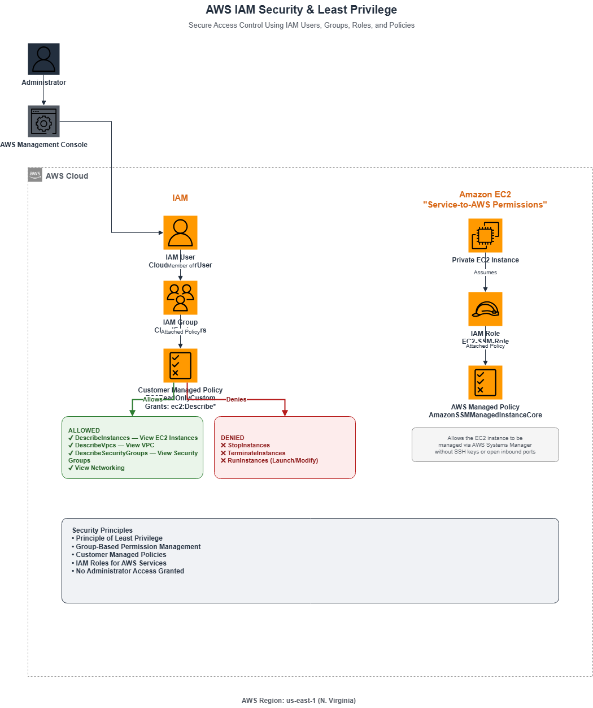

# AWS IAM Security & Least Privilege

This project demonstrates how to implement **AWS Identity and Access Management (IAM)** using the **Principle of Least Privilege**. It showcases how to securely manage permissions by creating IAM users, groups, custom policies, and IAM roles while preventing unnecessary administrative access.

The project also validates permission enforcement by demonstrating successful read-only access to Amazon EC2 resources and denied modification attempts.

---

## Architecture

<p align="center">
  
</p>

---

## Project Objectives

- Implement the Principle of Least Privilege using AWS IAM.
- Create and manage IAM Users and Groups.
- Develop a Customer Managed IAM Policy.
- Assign permissions through IAM Groups.
- Create an IAM Role for Amazon EC2.
- Attach AWS Managed Policies to IAM Roles.
- Validate permission enforcement using real AWS resources.

---

## AWS Services Used

- AWS Identity and Access Management (IAM)
- Amazon EC2
- AWS Systems Manager (IAM Role)
- AWS Managed Policies
- Customer Managed Policies

---

# IAM Architecture

The security model consists of:

- IAM User
- IAM Group
- Customer Managed Policy
- IAM Role
- AWS Managed Policy
- Amazon EC2

Instead of assigning permissions directly to users, permissions are granted through IAM Groups following AWS security best practices.

The EC2 instance receives AWS service permissions through an IAM Role instead of long-term credentials.

---

# Security Design

This project follows the **Principle of Least Privilege**, ensuring identities receive only the permissions required to perform their intended tasks.

### IAM User

- Created without permissions
- Added to an IAM Group
- Console access enabled for testing

### IAM Group

- Centralized permission management
- Permissions inherited by group members

### Customer Managed Policy

Allows only:

- View EC2 Instances
- View VPC
- View Security Groups
- View Networking

Denies modification actions such as:

- Stop Instances
- Start Instances
- Terminate Instances
- Launch Instances

### IAM Role

Created an IAM Role for Amazon EC2 using the AWS managed policy:

```
AmazonSSMManagedInstanceCore
```

This demonstrates how AWS services receive temporary credentials through IAM Roles instead of access keys.

---

# Implementation Steps

## 1. IAM Dashboard

Opened the AWS Identity and Access Management service.

### Screenshot


---

## 2. Create IAM User

Created a dedicated IAM user.

User Name:

```
CloudEngineerUser
```

Initially created without permissions.

### Screenshot


---

## 3. Create IAM Group

Created an IAM Group to centrally manage permissions.

Group Name:

```
CloudEngineers
```

### Screenshot


---

## 4. Add User to Group

Added the IAM User to the CloudEngineers group.

Permissions are inherited from the group rather than assigned directly to the user.

### Screenshot


---

## 5. Create a Customer Managed Policy

Created a custom IAM policy granting read-only access to Amazon EC2 resources.

Policy Name:

```
EC2ReadOnlyCustom
```

Permissions:

```
ec2:Describe*
```

### Screenshot


---

## 6. Attach Policy to the Group

Attached the custom IAM policy to the CloudEngineers group.

All users within the group automatically inherit these permissions.

### Screenshot


---

## 7. Enable Console Access

Enabled AWS Management Console access for the IAM User to validate permissions.

### Screenshot


---

## 8. Create an IAM Role

Created an IAM Role for Amazon EC2.

Role Name:

```
EC2-SSM-Role
```

Attached AWS Managed Policy:

```
AmazonSSMManagedInstanceCore
```

### Screenshot


---

## 9. Attach IAM Role to EC2

Attached the IAM Role to the EC2 instance.

This enables AWS services to securely access AWS resources without storing long-term credentials.

### Screenshot


---

## 10. Validate Read-Only Access

Logged in using the IAM User.

Successfully viewed EC2 resources using the custom policy.

### Screenshot


---

## 11. Validate Least Privilege

Attempted to perform administrative actions against an EC2 instance.

AWS correctly denied the request because the custom policy only grants read-only permissions.

### Screenshot


---

# Validation

### Expected

The IAM User should:

- View EC2 resources.
- Be unable to modify AWS infrastructure.

### Observed

- Successfully viewed EC2 instances.
- Successfully viewed networking resources.
- Received **Access Denied** when attempting administrative actions.

### Result

The custom IAM policy correctly enforced the Principle of Least Privilege.

---

# Design Decisions

## Why use IAM Groups?

Managing permissions through IAM Groups simplifies administration and ensures consistent access control across multiple users.

---

## Why use a Customer Managed Policy?

Customer Managed Policies provide fine-grained permission control and can be tailored to specific organizational requirements, unlike broad administrative policies.

---

## Why use IAM Roles?

IAM Roles provide temporary AWS credentials to services such as EC2, eliminating the need to store long-term access keys on instances.

---

# Security Principles Demonstrated

- Principle of Least Privilege
- Group-Based Permission Management
- Role-Based Access Control (RBAC)
- Temporary AWS Credentials
- Customer Managed Policies
- Separation of Duties

---

# Lessons Learned

During this project I gained practical experience with:

- AWS IAM
- IAM Users
- IAM Groups
- IAM Roles
- Customer Managed Policies
- AWS Managed Policies
- Permission Inheritance
- Least Privilege
- IAM Policy Validation
- EC2 IAM Role Attachment
- AWS Security Best Practices

---

# Skills Demonstrated

- AWS Identity and Access Management (IAM)
- AWS Security
- Amazon EC2
- IAM Users
- IAM Groups
- IAM Roles
- IAM Policies
- Principle of Least Privilege
- Cloud Security
- Access Control
- Infrastructure Documentation

---

# Future Improvements

Potential enhancements include:

- Implement Multi-Factor Authentication (MFA) for IAM users.
- Create permission boundaries for delegated administration.
- Apply attribute-based access control (ABAC).
- Integrate IAM Identity Center (AWS IAM Identity Center) for centralized workforce access.
- Audit IAM activity using AWS CloudTrail.

---

## Repository Structure

```
aws-iam-security
│
├── Architecture
│   ├── aws-iam-security-architecture.drawio
│   └── aws-iam-security-architecture.png
│
├── Screenshots
│   ├── Custom-policy-created.png
│   ├── EC2-role-attached.png
│   ├── IAM-dashboard.png
│   ├── IAM-group-created.png
│   ├── IAM-role-created.png
│   ├── IAM-user-console-access.png
│   ├── IAM-user-created.png
│   ├── Permission-test-denied.png
│   ├── Permission-test-success.png
│   ├── Policy-attached-to-group.png
│   └── User-added-to-group.png
│
├── LICENSE
├── README.md
└── .gitignore
```

---

## Author

**Dennis Owoju**

Final-Year Computer Engineering Student

Aspiring Cloud Engineer | AWS | Cybersecurity | Networking
